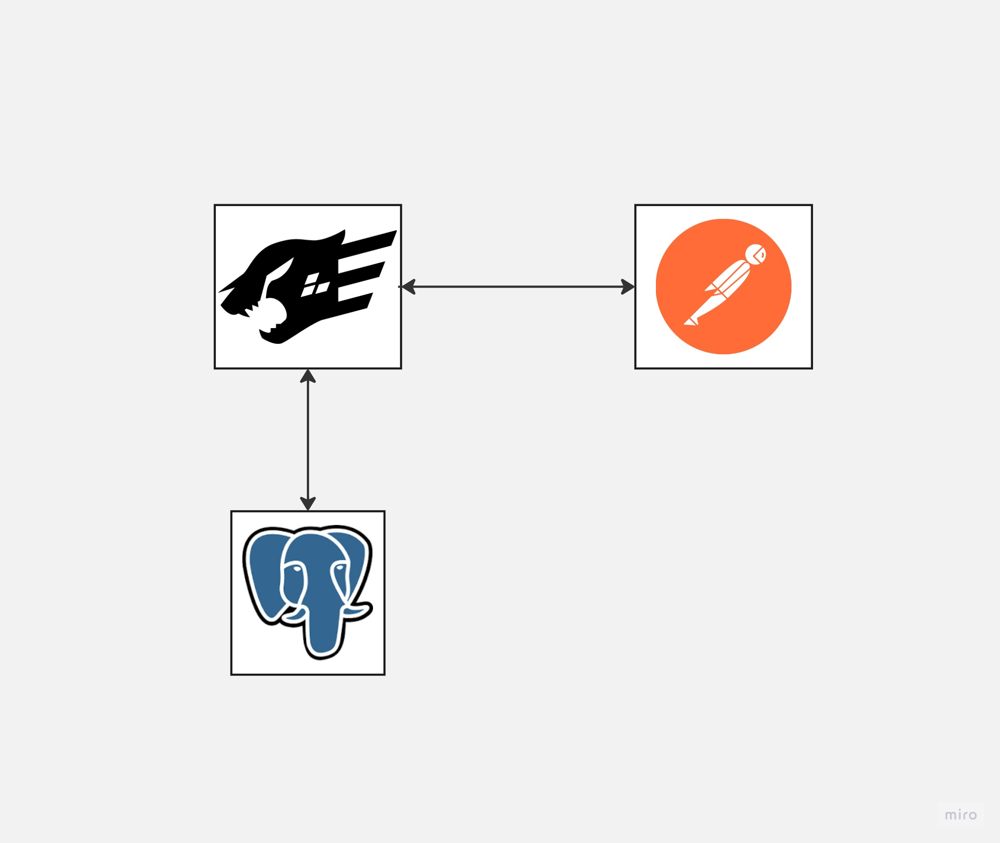

# LMS(학습 관리 시스템)

학생들이 강의를 확인, 수강신청하고 교수들이 새로운 강의를 개설하는 앱 기능구현만 해보았습니다.

---
## 아키텍처

# ERD

---
# 핵심기능
- 사용자는 모든 수업을 조회할 수 있다
- 사용자는 특정 분류의 수업을 조회할 수 있다(예: 강의자/ 수업명 / 수업코드 등)
- 사용자는 수업을 수강신청 할 수 있다
- 사용자는 모든 수강중인 수업을 조회할 수 있다
- 사용자는 이메일 정보와 같은 개인정보를 변경할 수 있다
- 사용자의 타입이 강의자일 경우 새로운 수업을 생성할 수 있다
- 사용자는 수업에 대한 수강신청을 취소 할 수 있다
